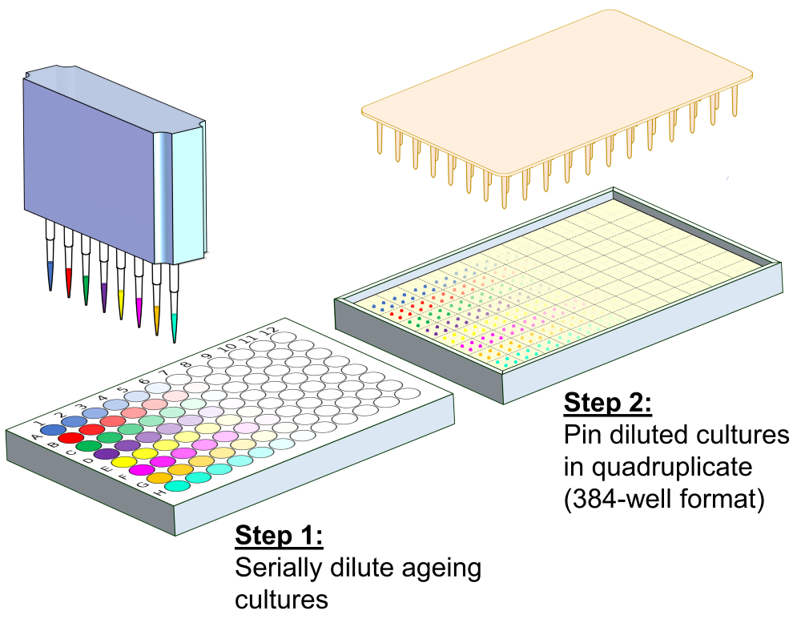
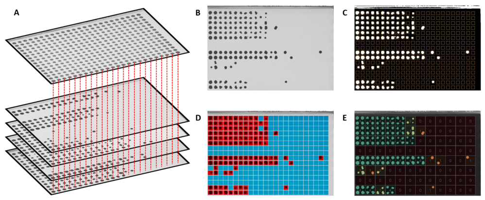

```{r setup, include=FALSE}
knitr::opts_chunk$set(echo = TRUE)
```

# DeadOrAlive
Analysis of High-throughput Colony Forming Unit Assays

## Installation
```{r eval=FALSE}
install.packages("adimpro")
package <- "https://cran.r-project.org/src/contrib/Archive/PET/PET_0.5.1.tar.gz"
fileLocation <- tempfile()
download.file(package, fileLocation)
install.packages(fileLocation, type="source", repos=NULL)
install.packages("BiocManager")
BiocManager::install("EBImage")
install.packages(c("jpeg", "tiff", "logging", "ggplot2"))
package <- "https://cran.r-project.org/src/contrib/Archive/gitter/gitter_1.1.1.tar.gz"
fileLocation <- tempfile()
download.file(package, fileLocation)
install.packages(fileLocation, type="source", repos=NULL)
install.packages(c("zoo", "magick", "gplots", "RColorBrewer", "rmarkdown", "toOrdinal", "cobs", "rootSolve"))
install.packages("devtools")
devtools::install_github("JohnTownsend92/DeadOrAlive", build_vignettes=TRUE)
```

## Tutorial

```{r}
library(DeadOrAlive)
library(ggplot2)
```

This tutorial will teach you how to analyse high-throughput colony forming unit (CFU) assay data as described in Romila et al., 2021. This assay facilitates high-throughput chronological lifespan (CLS) studies in microorganisms such as *Saccharomyces cerevisiae* or *Schizosaccharomyces pombe* by using robotics to automate CFU plating in a highly parallelisable manner (Figure 1).

```{r out.width="100%", echo=FALSE}

```

**Figure 1**: Schematic depiction of experimental protocol.

### Image Analysis

In order to estimate the number of colony forming units for a particular sample, the pattern of colonies must first be analysed. `colonyThreshold()` will take a batch of images of agar plates and identify whether or not there is a colony in each position. For this, it is critical to provide a reference image to aid colony identification in sparsely populated regions of the plate (Figure 2A).

```{r out.width="100%", echo=FALSE}

```
**Figure 2**: Outline of image analysis pipeline.

`colonyThreshold()` wraps the `gitter()` function in the [gitter](http://omarwagih.github.io/gitter/) package in order to perform the image analysis. As such, all of the arguments used by `gitter()` are available in the `colonyThreshold()` function. Of particular importance are:

* `plate.format` – the format of the agar plate
* `well.plate.format` – the format of the plate used for serial dilutions
* `inverse` – have colours in the image been inverted? For example, when a scanner is used to take images of the plate, the colonies will appear darker than the background

`colonyThreshold()` does not return any objects, but instead creates up to 4 files for each raw image processed (Figure 2B). These are:

* **DAT file** A tab delimited file containing quantified colony sizes, as described in [gitter](http://omarwagih.github.io/gitter/#gettingstarted). A sixth column marking whether a colony has been classified as present (1) or absent (0) is added
* **Gridded image** Image showing colony identification by aligning colonies to the grid identified in the reference image, as described in [gitter](http://omarwagih.github.io/gitter/#gettingstarted) (Figure 2C)
* **Threshold image** Image showing whether a colony has been classified as present or absent for each position on the plate (Figure 2D)
* **Count image** Image showing how many colonies have been classified as present for each sample at each dilution factor (Figure 2E)
 
It is particularly important to manually check the **threshold image** in order to confirm that colonies have been correctly marked as present or absent. The software used to estimate the number of colony forming units from the pattern of colonies observed is robust to the occasional misclassification, so it does not matter if there are a few mistakes. However, any plates for which there are a substantial number of errors will need to be re-scanned and re-analysed.

There are some demo images stored within the package. The images can be accessed and image analysis performed using the following code:
```{r eval=FALSE}
#Get the directory of files to be analysed
dir <- system.file("extdata", "images", package="DeadOrAlive")

#View the files
list.files(dir)

#Get the reference image
reference <- system.file("extdata", "reference.jpg", package="DeadOrAlive")

#Analyse the files to identify whether there is a colony or not in each position
#Note: This will create a new directory called 'Image_Analysis'
colonyThreshold(dir=dir, reference=reference)
```

### Extraction of Colony Patterns

The next objective is to collect the present/absent colony information and assemble it correctly based on the identity of the plates, time points and samples. This is achieved by supplying two supporting files – the **plate reference file** and the **sample reference file** – to the `extractColonyVectors()` function. This function will take a directory of processed **DAT files** generated by the `colonyThreshold()` function and extract a vector containing the number of colonies present at each dilution factor for each sample at each time point. For this to work, it is also necessary to provide the `plate.format` for the agar plate and the `well.plate.format`.

Demo files can be accessed from within the package. In this case, we are analysing an experiment where the lifespan of 48 different strains were measured at 7 different time points. Given that 8 strains can be measured in parallel on a single agar plate, this means that 6 agar plates are required per day. The **sample reference file** shows which strains are plated on each of the 6 plates. The **plate reference file** provides the identity of each image - i.e. which groups of strains at which time points are plated on each image. These two files, in addition to the directory containing the processed **DAT files**, are passed to the `extractColonyVectors()` function as follows:

```{r eval=FALSE}
#Get a csv file showing the identity of each sample on each plate
sampleReferenceFile <- system.file("extdata", "sampleReferenceFile.csv", package="DeadOrAlive")
View(read.csv(sampleReferenceFile))

#Get a csv file showing the identity of each plate to be analysed
plateReferenceFile <- system.file("extdata", "plateReferenceFile.csv", package="DeadOrAlive")
View(read.csv(plateReferenceFile))

#Get the patterns of colonies from the files (from left to right across the plate)
myColonyVectors <- extractColonyVectors("Image_Analysis", plateReferenceFile, sampleReferenceFile)
myColonyVectors
```

### Estimation of Colony Forming Units

The next challenge is to estimate the number of colony forming units present for each sample at each time point. This is achieved via maximum likelihood estimation using the `analyseColonyVectors()` function – that is to say, the function determines what number of colony forming units in the culture is most likely to give rise to the pattern of colonies observed. This achieved as follows:

```{r eval=FALSE}
#Perform a maximum likelihood estimation of the number of viable cells
#Note: This will save a csv and markdown file in the current working directory
CFUsMLE <- analyseColonyVectors(myColonyVectors)
```

```{r echo=FALSE}
#Get a data.frame showing maximum likelihood estimation as produced by analyseColonyVectors
CFUsMLE <- system.file("extdata", "CFUsMLE.csv", package="DeadOrAlive")
CFUsMLE <- read.csv(CFUsMLE)
```

### Analysis of Lifespan Curves

As a first step, it is advisable to perform some quality control steps. The maximum likelihood estimator is highly sensitive to outliers, and as such the `analyseColonyVectors()` function implements some quality control steps to remove outliers from the patterns of colonies. It is sensible to remove data points for which a lot of the colony pattern had to be excluded in order for a robust maximum likelihood estimation to be achieved:

```{r}
#Remove low quality data points
CFUsMLE <- CFUsMLE[CFUsMLE$TotalExclusions<=1,]
```

We can also calculate a proxy for each lifespan curve in order to summarise the lifespan of a culture with a single number. The `plotProxy()` function can be used to display how the proxy is calculated for a particular sample. For this, a spline is fitted to the data, and the default proxy is calculated as the square root of the amount of time taken for culture viability to decrease to 5%.

```{r}
#Plot proxy calculation for the wt (972 h-)
g1 <- plotProxy(CFUsMLE, "972 h-")
print(g1)
```

Proxies for all samples can be calculated using the `calculateProxy()` function. We can then add an extra column in `CFUsMLE` and plot the lifespan curves according to proxy. This is always a recommended step in order to check that the proxy looks sensible.

```{r}
#Calculate a proxy for all samples
proxy <- calculateProxy(CFUsMLE)

#Add proxies to CFUsMLE
CFUsMLE$Proxy <- proxy$Proxy[match(CFUsMLE$Sample, proxy$Sample)]

#Plot all lifespan curves and color by proxy
g2 <- g2 <- ggplot(CFUsMLE, aes(Time, ColonyFormingUnitsPerDroplet + 1, group=Sample, color=Proxy))
g2 <- g2 + geom_point() + geom_line()
g2 <- g2 +  scale_y_log10() + xlab("Time (days)") + ylab("CFUs / droplet + 1") + scale_color_viridis_c()
print(g2)
```